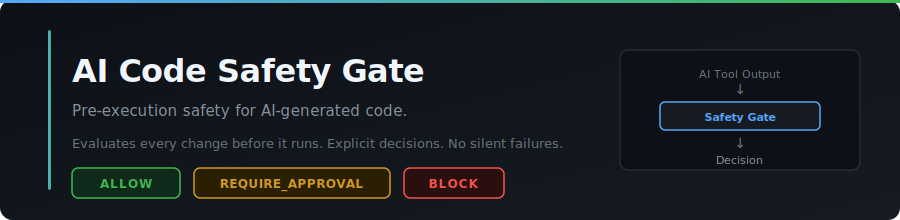
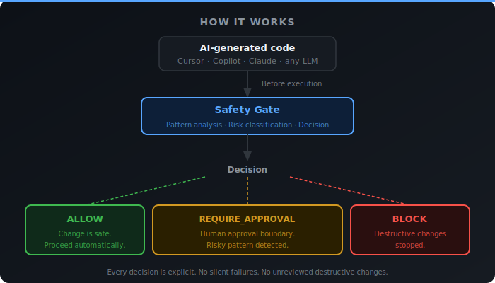

<p align="center">
  
</p>

# PROVE BY GENESIS — AI Code Safety Gate

**Pre-execution safety for AI-generated code.**

Every AI-generated change is classified before it runs.
Decisions are explicit: `ALLOW`, `REQUIRE_APPROVAL`, or `BLOCK`.
No silent failures. No unreviewed destructive changes.

---

## Live Demo

**Try it now — no install required:**

**[https://aicodesafety.com](https://aicodesafety.com)**

Or clone and run locally in under two minutes.

---

## What It Does in 10 Seconds

AI coding tools can generate code that looks correct but silently destroys things.

This gate sits **between AI output and execution**. It evaluates every change and returns one of three decisions before the code runs.

```
module.exports = null;   →  BLOCK
if (false) { ... }       →  REQUIRE_APPROVAL
function formatDate(){}  →  ALLOW
```

The goal is not to replace human review. The goal is to stop obvious destructive changes before they run.

---

## How It Works

<p align="center">
  
</p>

---

## The Problem

AI coding tools move fast. Sometimes too fast.

A single AI-generated line can silently destroy a module's public interface:

```js
module.exports = null;
```

Your app won't crash immediately. It will just stop working.
The AI that wrote it had no idea.

Other patterns that slip through unnoticed:

- Dead-code gates that disable entire code paths (`if (false)`)
- Export rewrites that break downstream consumers
- Logic replacements that look like refactors but change behavior

---

## The Solution

GENESIS evaluates every AI-generated change before execution.

| Decision | Meaning |
|---|---|
| `ALLOW` | Pattern is safe — proceed automatically |
| `REQUIRE_APPROVAL` | Risky pattern detected — human sign-off required |
| `BLOCK` | Destructive change stopped — not executed |

---

## Try It in the Browser

Open the live demo at **[https://aicodesafety.com](https://aicodesafety.com)** — no install, no account.

The browser demo includes four scenarios you can run directly:

- Safe helper function → `ALLOW`
- Dead-code gate `if(false)` → `REQUIRE_APPROVAL`
- Export nullification `module.exports = null` → `BLOCK`
- Custom input — paste your own code and see the decision

Or open `index.html` directly from this repo in any browser.

---

## Run Locally

```bash
git clone https://github.com/aicodesafety/genesis-ai-code-safety-demo.git
cd genesis-ai-code-safety-demo
npm install
```

Run the scenarios:

```bash
npm run demo            # module.exports = null → BLOCK
npm run demo:safe       # safe helper function → ALLOW
npm run demo:danger     # module.exports = null → BLOCK
npm run demo:dead-code  # if(false) dead-code gate → REQUIRE_APPROVAL
```

Or run directly:

```bash
node scripts/genesis-demo.js examples/demo-safe.json
node scripts/genesis-demo.js examples/demo-danger.json
node scripts/genesis-demo.js examples/demo-dead-code.json
```

---

## Demo Scenarios

| Scenario | Pattern | Decision |
|---|---|---|
| `demo-safe.json` | Safe helper function added | `ALLOW` |
| `demo-danger.json` | `module.exports = null` — export destruction | `BLOCK` |
| `demo-dead-code.json` | `if(false)` — dead-code gate | `REQUIRE_APPROVAL` |

---

## What This Demo Intentionally Excludes

This is a public-safe demo shell. It demonstrates the decision surface — the output layer that developers and integrators interact with.

This public demo does not include the private GENESIS core.

What is excluded:

- Real-time AI diff analysis pipeline
- Private risk engine and pattern classifier
- Execution control layer
- Electron-based developer panel

None of those are in this repository. GENESIS core is always private.

The demo is intentionally minimal. It shows the concept, the decision types, and the output format — not the full product.

---

## Who This Is For

**Developers using AI coding assistants** (Cursor, Copilot, Claude Code, Codeium, etc.)
You have seen the AI make a change that looked fine — then broke something downstream.
GENESIS gives you a safety layer without slowing down your flow.

**Engineering leads building AI-assisted teams**
You want your team to move fast with AI — but not break production.
GENESIS is a control layer that makes that possible.

**AI tooling builders**
You are building on top of LLMs and need deterministic safety gates before execution.
GENESIS is designed to plug in between generation and execution.

---

## Why This Matters

AI coding tools are now part of production workflows. The assumption that AI output is always safe to run is the gap this addresses.

The safety problem is not about AI being wrong. It is about AI being confident and fast while making structural changes that are difficult to detect without explicit classification.

A pre-execution gate is not a review tool. It is a guardrail that runs in milliseconds and catches the class of changes that no developer wants silently deployed.

---

## Repo Status

Early public demo — actively seeking feedback from developers using AI coding tools.

**Live demo:** [https://aicodesafety.com](https://aicodesafety.com)

**Public repo:** [https://github.com/aicodesafety/genesis-ai-code-safety-demo](https://github.com/aicodesafety/genesis-ai-code-safety-demo)

Feedback and questions: [hello@aicodesafety.com](mailto:hello@aicodesafety.com)

---

## License

MIT — see [LICENSE](LICENSE)
